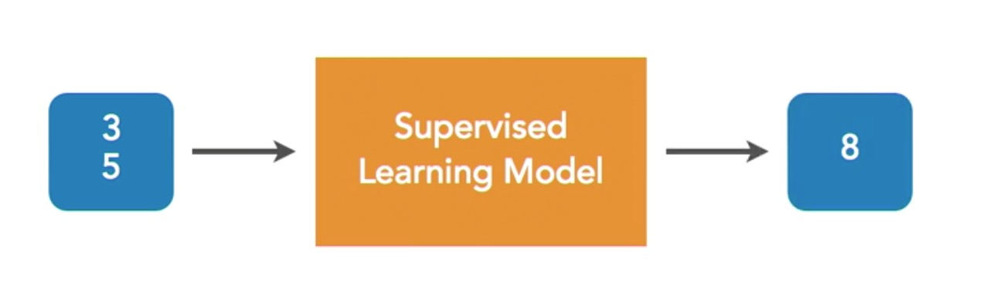
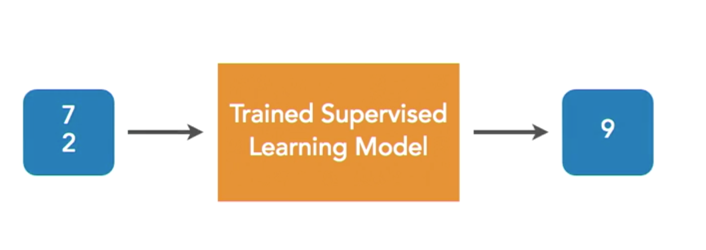

## Lynda-SimpleMachineLrn-And-AI_Foundations

Finally found pleasant "for I-Diots" tutorial to follow
That's what suits me! =)

[∞ Machine-Learning-Essential-Training-Value-Estimations ∞](https://www.lynda.com/Data-Science-tutorials/Machine-Learning-Essential-Training-Value-Estimations)


simplest possible example
need to make machine understand what caused this result
after many examples machine understands that result was achieved by addition
That's why integral things are the very basics of these actions
Integral is: you trying to __predict the function of getting the result__
- [ ] get clear about wether it's defining derivative or integral process


##### Lesson1 Script_1

```python
def estimate_home_value(size, bedrooms):
    #assume all homes wort at least 50k
    value = 50000
    #adjust the value estimate based on the size of the house
    value = value + (size * 92)
    #adjust the value estimate based on the number of the bedrooms
    value = value + (bedrooms * 10000)
    return value

value = estimate_home_value(3800, 5)

print("Estimated value is:")
print(value)
```
here we defined weights by ourselves
this algorithm is called __linear regression__
