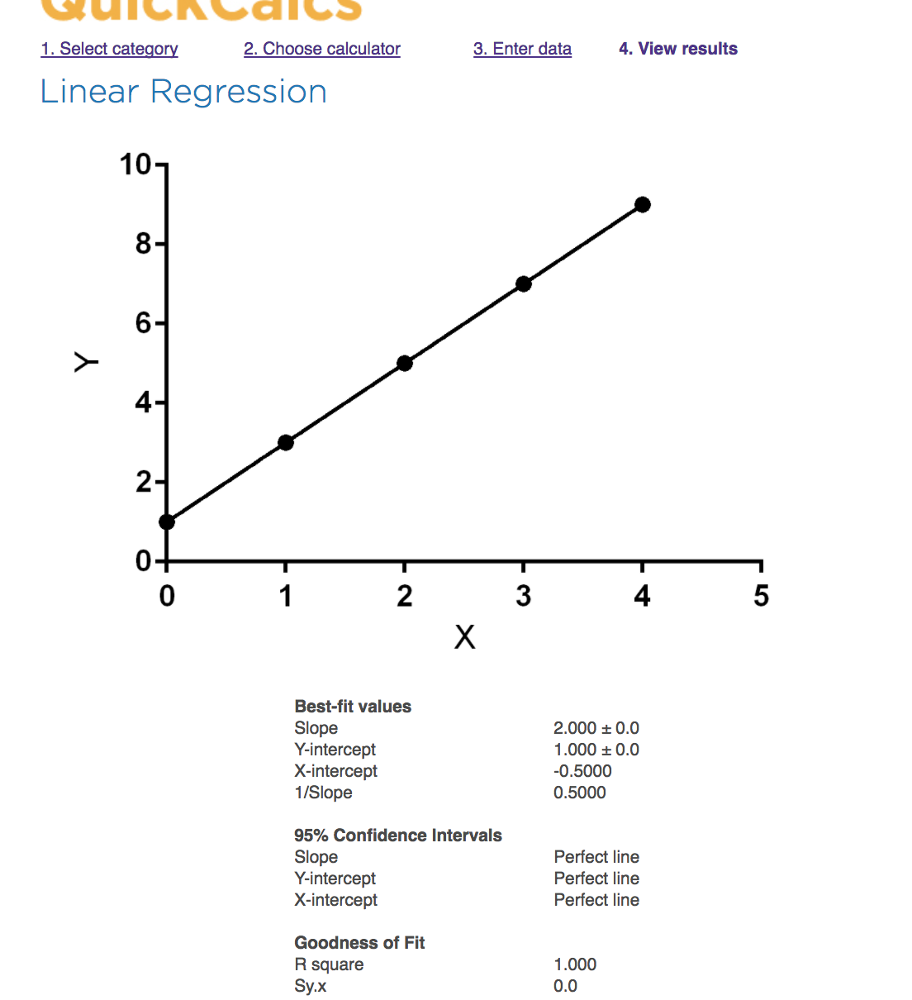

## Lynda-SimpleMachineLrn-And-AI_Foundations

Finally found pleasant "for I-Diots" tutorial to follow
That's what suits me! =)

[∞ Machine-Learning-Essential-Training-Value-Estimations ∞](https://www.lynda.com/Data-Science-tutorials/Machine-Learning-Essential-Training-Value-Estimations)


simplest possible example
need to make machine understand what caused this result
after many examples machine understands that result was achieved by addition
That's why integral things are the very basics of these actions
Integral is: you trying to __predict the function of getting the result__
- [ ] get clear about wether it's defining derivative or integral process


##### Lesson1 Script_1

```python
def estimate_home_value(size, bedrooms):
    #assume all homes wort at least 50k
    value = 50000
    #adjust the value estimate based on the size of the house
    value = value + (size * 92)
    #adjust the value estimate based on the number of the bedrooms
    value = value + (bedrooms * 10000)
    return value

value = estimate_home_value(3800, 5)

print("Estimated value is:")
print(value)
```
here we defined weights by ourselves
this algorithm is called __linear regression__


#### Lesson2 Cost_function
Previous code can we rewritten in simpler way

```python
house_value = 5000 + (size * weight1) + (bedrooms * weight2)
```
Goal from this point is to __define weights__ which __most closely__ correlates with real word values

So we get data and do reverse-engineering
We have training data


From here tutorial goes into "let's do that and that and cost function, and baaam, here we go"

I don't like not to have opportunity to play with cost function by myself.
Let's go to learn hot code linear regression, yo!


[__∞Linear regression for machine learning∞__](https://machinelearningmastery.com/simple-linear-regression-tutorial-for-machine-learning/)

There are two types of them simple and multiple
We start with simple

[Wiki. Simple linear regression.  ](https://en.wikipedia.org/wiki/Simple_linear_regression)

```
y = B0 + B1 * x
```
Technically, __B0__ is called the __intercept__ because it determines where the line intercepts the y-axis
In machine learning we can call this __the bias__*(this word used to confuse me. Now its clear = __offset, displacement__)* , because it is added to offset all predictions that we make.

The __B1__ term is called __the slope__ because it defines the slope of the line or how x translates into a y value before we add our bias.

We can start off by estimating the value for B1 as:
```
B1 = sum((xi-mean(x)) * (yi-mean(y))) / sum((xi – mean(x))^2)
```
Where mean() is the average value for the variable in our dataset. The xi and yi refer to the fact that we need to repeat these calculations across all values in our dataset and i refers to the i’th value of x or y.

....Aghhmm

Still too dense, am i really that dumb ))


https://www.youtube.com/watch?v=ZkjP5RJLQF4  
This video simpler then even KhanAcademy


Close to real life situation

__Big task:__  
Waiter trying to make predictions about tips base on amount of the bill.

__First task:__  
predict tips, base on only 6 values of the tips given , without bill price.
From here only way can predict further tips is only __the mean__

Residuals=Errors

Then its coming to __SSE -  Sum of squared errors__


❓ I'm not really clear why does is calculates my this way. Why not just to take modules of residuals?  
ToDo [ ] look it up


##### Goal of Simple_linear_regression
create a liner model that minimises SSE


Notes from that video


[https://www.graphpad.com/quickcalcs/linear1/](https://www.graphpad.com/quickcalcs/linear1/)
Good resource to draw graph and give you info


[That video put everything together](https://www.youtube.com/watch?v=Qa2APhWjQPc) Thank you @Brandon Foltz

[ ] TODO paste last notes pics into


except there are no explanation for slope formula.
Most likely it's trigonometry

[Khan academy Introduction to residuals and least squares regression ](https://www.youtube.com/watch?v=yMgFHbjbAW8)
mister great


4 Oct 2017 00:10
trying to get into proof of Suare errror regression, but feels like its  over my normal -efforts-understaning skills.
Definitely will take me much time, and all what it'll give is a pride that I handled it.

Meanwhile found good thing for doing plots. Small online MatLAb [https://plot.ly/create/](https://plot.ly/create/)

Now this [https://machinelearningmastery.com/simple-linear-regression-tutorial-for-machine-learning/](https://machinelearningmastery.com/simple-linear-regression-tutorial-for-machine-learning/) became more understandable .  
Time to move forward

